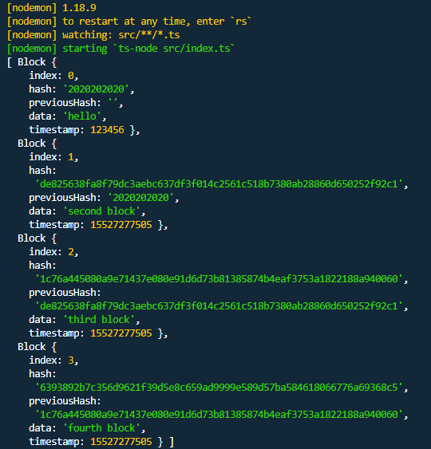

# typescript block chain

## yarn
  - typescript 글로벌 설치
    > yarn global add typescript

  - tslint 설치
    > yarn add tslint

  - 해쉬 계산 라이브러리 설치
    > yarn add crypto-js

## tslint 를 위한 설정
  - settings.json, tslint auto save를 할려면 다른 auto save 를 꺼야함
  ```json
  "editor.formatOnSave": false,
  "[javascript]": {
    "editor.formatOnSave": false
  },
  "eslint.autoFixOnSave": false,
  "editor.codeActionsOnSave": {
    "source.fixAll.tslint": true
  },
  ```


## tsconfig.json 파일 생성
  > tsc --init

## package.json 설정
  - dev
    > 소스수정시 자동으로 watch 한다.

  - dev:tscwatch
    > 위의 dev 와는 틀리게 소스수정시 빌드한 후 dist 에 생성된 js 파일을 실행하여 watch 한다.

  - start
    > prestart 를 먼저 실행하여 tsc 로 빌드후 생성된 index.js 실행함(watch 아님)

  - package.json - scripts
    ```json
    "scripts": {
      "dev": "nodemon --watch src/**/*.ts --exec ts-node src/index.ts",
		  "dev:tscwatch": "tsc-watch --onSuccess \" node dist/index.js\" ",
		  "start": "node index.js",
		  "prestart": "tsc"
    }
    ```

## 스크린샷
